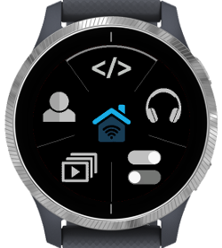
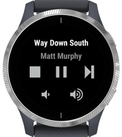
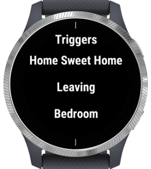
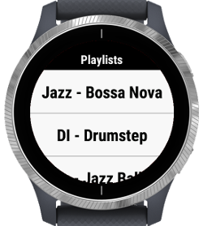
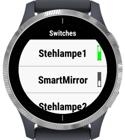

# SmartPiHome

The repo hosts the code for the SmartHome client for Garmin watches.
The app is published on the Garmin Connect IQ store here: https://apps.garmin.com/en-US/apps/c745527d-f2af-444e-ac28-4d82306ab708

## Features of the App
This are the basic features of the SmartHome client
- Basic remote music control
- Play existing Playlists
- Triggers 5 predefined actions
- Set remove switch state

The server application is open source (https://github.com/dabastynator/SmartHome)

This is a tutorial to setup the server on a raspberry pi: https://www.instructables.com/Smart-Home-by-Raspberry-Pi/

## Screenshots

|Main View|Basic Music Control|5 Triggers|
|:----------------------:|:-------------------------:|:---------------------------:|
|  |    |    |

|Play Playlist|Control Switch|
|:----------------------:|:-------------------------:|
|  |    |