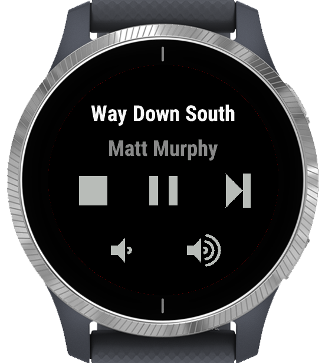
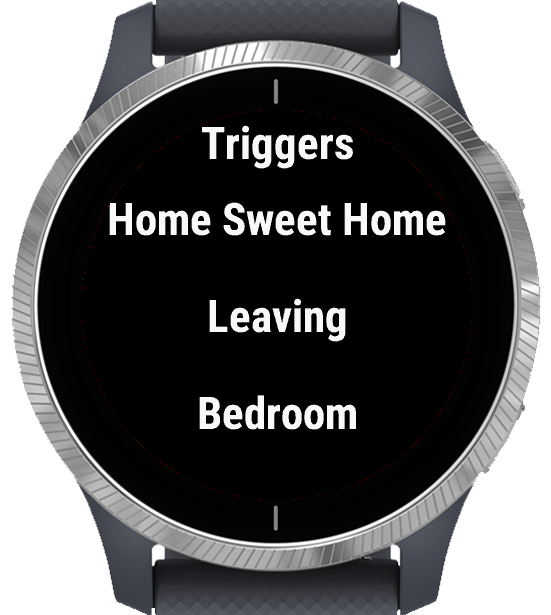

# SmartPiHome

The repo hosts the code for the SmartHome client for Garmin watches.
The watch app allows basic music control and triggers 5 predefined actions.

Main|Music|Trigger
:-------------------------:|:-------------------------:
  |  |  